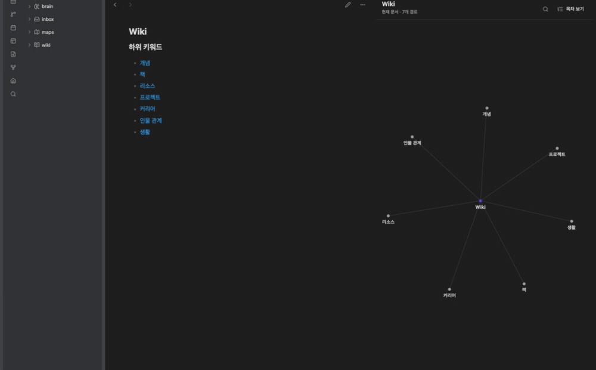
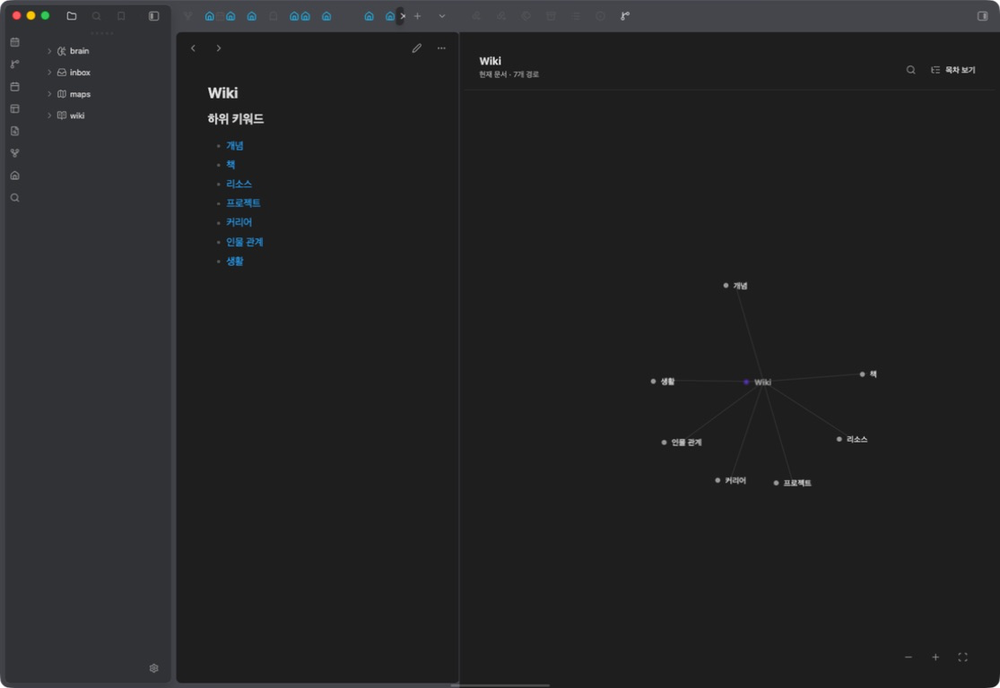
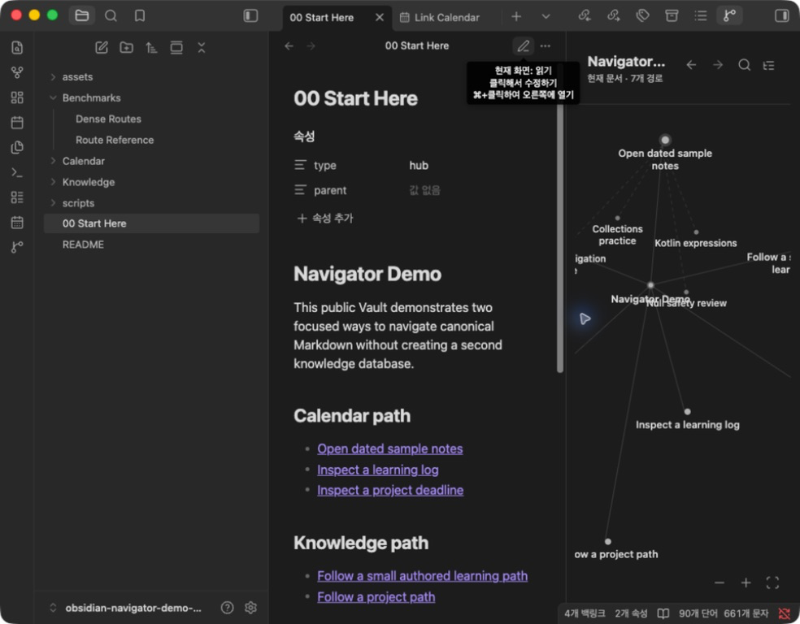

# Linked Graph Navigator

**Follow the paths you wrote, not every connection in your Vault.**

[](obsidian://show-plugin?id=linked-graph)
[](https://github.com/woonyong-kr/linked-graph/actions/workflows/lint.yml)
[](https://github.com/woonyong-kr/linked-graph/releases/latest)
[](LICENSE)

Linked Graph Navigator turns the links in your current Markdown note into a calm reading map beside the editor. It preserves the order you wrote, previews one next step on hover or focus, and opens the original note in one click—without turning the whole Vault into a hairball.





<p align="center">
  <a href="obsidian://show-plugin?id=linked-graph">Add to Obsidian</a>
  ·
  <a href="https://github.com/woonyong-kr/obsidian-navigator-demo-vault/releases/latest">Try the public demo Vault</a>
  ·
  <a href="https://community.obsidian.md/plugins/linked-graph">Community page</a>
</p>

## Why people keep it open

- **Current-note scope:** the navigator changes with the active Markdown editor.
- **Authored order:** routes keep the order and section context from the source note.
- **Two useful views:** switch between a direct-link graph and a compact outline.
- **One-hop preview:** hover or focus a route to see where it leads next.
- **Direct navigation:** click a route to open the canonical note; click the root to follow its configured parent.
- **Local and read-only:** no network requests, telemetry, generated maps, or Vault writes.
- **Desktop and mobile:** built only on Obsidian's public API.

Use it for a course index, project hub, research trail, onboarding guide, or any note where link order expresses what to read next. The source note remains the map; the plugin is only a live view of that intent.

## Quick start

1. Install **Linked Graph Navigator** from **Settings → Community plugins**.
2. Open a Markdown note containing links such as `[[Concept]]` or `[[Guide#Next step]]`.
3. Run **Open Linked Graph Navigator for the current note** or select the ribbon icon.
4. Hover or focus a direct node to preview its outgoing links. Click it to open the note.
5. Switch to **Outline** when you want the complete authored order and section labels.

Want a safe example first? Download the [public demo Vault](https://github.com/woonyong-kr/obsidian-navigator-demo-vault/releases/latest) and follow its five-minute walkthrough. It includes ordinary routes, long labels, next-step previews, and a dense-note fallback.

## From note to next step

1. **Open a linked note.** The sidebar follows the active Markdown editor automatically.
2. **See the intended routes.** Only resolved outgoing links appear; unrelated Vault connections stay out of the way.
3. **Preview the next step.** Hover or keyboard-focus a route to reveal its next outgoing links.
4. **Continue in Markdown.** Click once to open the original note. Back and Forward retrace only this session's path.

There is no relationship database or saved graph layout. Disable the plugin and every link remains exactly where you wrote it.

## Graph and Outline

The graph is for spatial scanning and direct manipulation:

- drag any primary node after the pointer crosses a deliberate movement threshold;
- pan the background, use the wheel or controls to zoom, and fit the current graph;
- hover movement is local, bounded, and returns smoothly to its origin;
- a completed drag becomes the node's position for this session, while cancel or focus loss restores the previous position;
- node colours use existing canonical metadata only; titles never infer type.



The Outline preserves reading order:

- links remain grouped under the section where they were written;
- search matches route titles and section context;
- plain bullet text can label a group without becoming a graph node;
- the full list remains available when a dense graph is visually bounded.

Keyboard flow: run **Focus route search**, type a route or section name, press `Arrow Down` to focus the first match, then press `Enter` to open it.

## Why not the built-in Graph view?

The built-in Graph view answers “how is this network connected?” Linked Graph Navigator answers “where did I intend the reader to go next?”

| | Linked Graph Navigator | Obsidian Graph |
| --- | --- | --- |
| Scope | Active note | Vault or local neighbourhood |
| Direction | Outgoing links in written order | Connections in multiple directions |
| Layout | Focused routes and optional next-step preview | Relationship network |
| Location | Persistent sidebar navigator | Separate graph view |
| Primary action | Follow an intended reading path | Inspect connections |
| Knowledge writes | None | None |

The two views complement each other: use Graph for exploration and Linked Graph Navigator for deliberate reading paths.

## Supported Markdown

Visible routes come from resolved internal links in the active note:

```markdown
## Learn

- [[Language fundamentals]]
  - [[Functions]]
  - [[Collections#Transforming values]]

## Practice

- [Executable exercises](Exercises/README.md)
```

The parser supports wikilinks, heading and block subpaths, aliases, and relative Markdown links. It ignores embeds, external URLs, fenced code, inline code, comments, unresolved targets, and duplicate destinations. The first H1 is used as the visible note title when available.

## Performance and limits

- Direct graph capacity adapts to the measured panel area from 12 to 120 nodes.
- A hover preview shows at most 48 next-step nodes.
- Omitted routes are reported and remain available in Outline.
- A 5,000-route parser benchmark is documented in [benchmarks](docs/benchmarks.md).
- The demo Vault includes a [130-route fallback example](https://github.com/woonyong-kr/obsidian-navigator-demo-vault/blob/main/Benchmarks/Dense%20Routes.md).

These are visual safeguards, not data loss: the source Markdown remains canonical and unchanged.

## Privacy and ownership

Linked Graph Navigator is local-first and read-only:

- it makes no network requests and includes no telemetry;
- it never creates, edits, renames, or deletes Vault files;
- it stores no relationship database, layout, Canvas, sidecar, or duplicated note;
- search, collapse, graph positions, and navigation history are session-only;
- removing the plugin removes no knowledge.

See the detailed [UX contract](docs/ux-contract.md), [design system](docs/design-system.md), and [security policy](SECURITY.md).

## Troubleshooting

- **The navigator is empty:** confirm the active file is Markdown and its internal links resolve to files in the Vault.
- **A link is missing:** embeds, external URLs, code, comments, unresolved links, and duplicates are intentionally excluded.
- **Some graph routes are omitted:** switch to Outline for the complete list or enlarge the sidebar.
- **Hover preview is empty:** the focused destination has no resolved outgoing links.
- **A node opened instead of dragging:** begin with a deliberate movement; a short press is intentionally treated as a click.
- **The root is not clickable:** parent navigation appears only when the active note has a supported `parent` wikilink in frontmatter.

## Installation and compatibility

Install from **Settings → Community plugins → Browse → Linked Graph Navigator**. The plugin supports Obsidian 1.8.0 or later on desktop and mobile.

For a manual release install, download `main.js`, `manifest.json`, and `styles.css` from the [latest release](https://github.com/woonyong-kr/linked-graph/releases/latest) into `.obsidian/plugins/linked-graph/`, then reload Obsidian.

## Support and development

- Read the [changelog](CHANGELOG.md) and [roadmap](ROADMAP.md).
- Report a [bug or use case](https://github.com/woonyong-kr/linked-graph/issues/new/choose).
- Review the [contributing guide](CONTRIBUTING.md) before opening a pull request.

```bash
npm ci
npm run check
npm audit --omit=dev --audit-level=high
```

`npm run check` runs ESLint, unused-code analysis, TypeScript, CSS policy checks, the production build, 41 focused tests, and release-media validation. Node.js 20 or later is required.

## License

[MIT](LICENSE)
