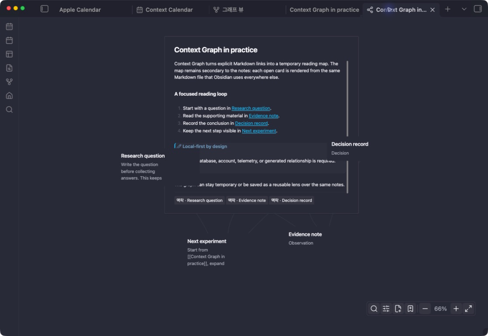
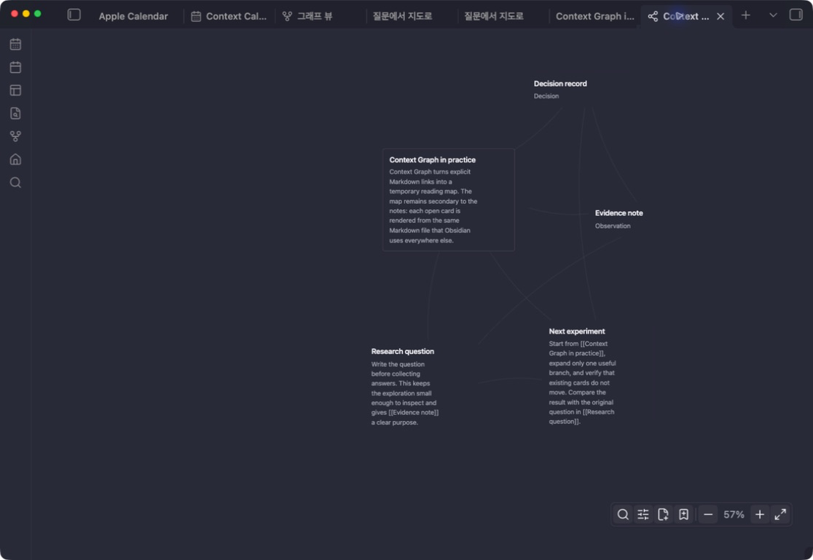
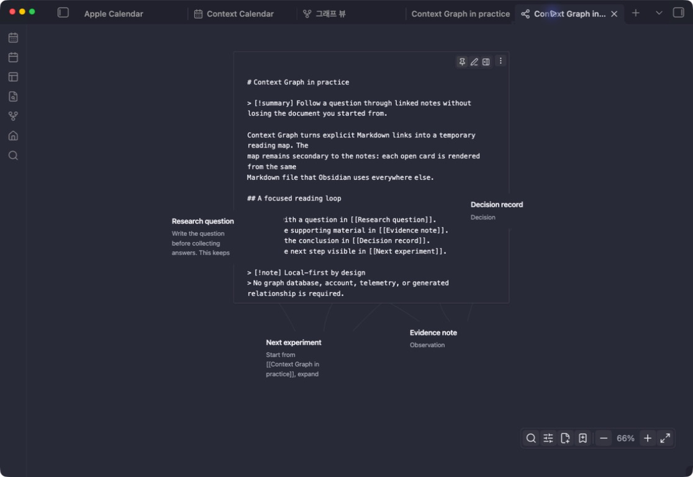

# Context Graph

**Read linked Markdown in place, expand one branch at a time, and keep your
map.**

Context Graph opens the current Markdown note and its direct links as one quiet
workspace. Read a linked note in place, expand only the branch that matters,
and keep editing the original Markdown without losing the surrounding context.



The centre card above is the actual note, rendered by Obsidian. Its neighbours
stay visible while the document scrolls, and opening or editing the card does
not move the map.

- **Start with a note, not a blank canvas.** One command resolves the current
  note and its direct links. There is no workspace or drawing step to maintain.
- **Read the real Markdown.** Headings, lists, callouts, embeds, code, tables,
  math, and plugin post-processors use Obsidian's Reading renderer.
- **Expand with intent.** Open one useful branch, collapse it again, or save the
  map only when the reading trail is worth keeping.

Markdown remains the only source of truth. Context Graph adds no account,
telemetry, remote service, graph database, semantic AI, or required frontmatter.

## Start with one note

1. Open a Markdown note.
2. Right-click the note and choose **Open linked-note reading map**, or run the
   same Context Graph command from the command palette.
3. Select a card to read it in place.
4. Use **Show _n_ neighbouring notes** to continue through one branch. Use the
   same action again to collapse that branch.
5. Choose **Save this graph** only if the exploration is worth keeping.

The first view is temporary. Closing it creates no graph file. Saving creates a
small `.context-graph` definition, while every card continues to read from its
Markdown source.

## A reading surface, not another knowledge store

Context Graph is useful when opening every linked note in a separate tab would
make you lose the question or evidence trail you are following. Typical uses
include:

- tracing notes produced by a long research or Q&A session;
- reviewing the evidence and follow-up around a decision;
- following prerequisites while learning; and
- keeping a root document and its changing neighbourhood visible.

Every visible relationship comes from an inspectable Markdown link, backlink,
or optional typed relationship. Context Graph does not infer that two notes are
related, and it does not turn the Vault into a second visual database.

## See the complete reading loop

These captures come from the real Obsidian desktop plugin using public-safe
sample notes. Context Graph does not replace the editor with a separate visual
database; each step stays on the same Markdown and the same graph coordinates.

### 1. Begin with the neighbourhood, not a blank canvas



Run one command from the note you are already reading. The first view shows the
resolved one-hop neighbourhood without asking for a workspace, layout, schema,
or drawing step. Compact cards are deliberately quiet so relationship lines and
titles describe the map instead of decorated containers.

### 2. Read the actual note in place

Select a title and that same card becomes the document surface shown at the top
of this page. The card and camera stay where the reader put them; long documents
scroll inside the card while neighbouring notes remain visible.

### 3. Inspect or edit the complete Markdown source



The pencil swaps Reading for the complete source, including frontmatter and the
Markdown syntax projected into the compact title and summary. Returning to
Reading updates the same card element and footprint. For properties UI, editor
commands, or more room, the adjacent panel action opens the same file in one
reused right-hand Obsidian editor without changing graph scope or layout.

## Choosing the right spatial tool

Obsidian's spatial tools can coexist; they optimize for different jobs.

| Tool | Best at | Use Context Graph when you need to... |
| --- | --- | --- |
| **Global Graph** | Seeing the shape of a whole Vault | Read one explicit neighbourhood instead of analysing the whole Vault. |
| **Local Graph** | A compact link map around the active note | Read and edit the linked notes inside the map. |
| **Canvas** | Authoring a freely arranged diagram or presentation | Derive the map from existing Markdown without maintaining duplicate cards. |
| [Excalidraw](https://github.com/zsviczian/obsidian-excalidraw-plugin) | Drawings, visual thinking, and media-rich canvases | Follow authored links without creating a drawing. |
| [Juggl](https://github.com/HEmile/juggl) | A stylable graph workspace with multiple layouts | Keep a deliberately narrow, document-first reading surface. |
| [ExcaliBrain](https://github.com/zsviczian/excalibrain) | A structured mind map from metadata and inferred roles | Show only inspectable authored links and optional typed relations. |
| [Breadcrumbs](https://github.com/michaelpporter/breadcrumbs) | Typed hierarchy, sequence, matrix, and trail views | Make ordinary links sufficient and read their source in place. |

## What appears in a graph

The initial graph contains the current Markdown note and one hop of resolved
links in both directions:

- ordinary wikilinks and Markdown links from the current note;
- backlinks from other Markdown notes to the current note; and
- optional typed relationships stored in `context_tree_links`.

Expanding a visible card makes that card another one-hop seed. It does not set a
global depth or unfold every branch. A card with no new neighbours does not show
an expansion action. Collapsing removes only the range introduced through that
seed; the seed itself and paths still reachable from another seed remain.

Missing files, unresolved links, non-Markdown files, and notes explicitly
removed from this graph are not added. Context Graph follows Obsidian's resolved
link index rather than guessing relationships from similar text.

## Read and edit without losing the map

Selecting a card opens Reading in the card's current position. The camera and
card coordinates do not move. Reading uses Obsidian's `MarkdownRenderer` inside
the same public Reading View class boundary used by themes, snippets, and
registered Markdown post-processors.

The pencil opens the complete source of that note inside the same card,
including frontmatter. Reading and Source keep one bounded outer footprint, so
long content scrolls inside the card instead of pushing the map around. Returning
to Reading updates that same card element; it does not delete and recreate the
card or run a new layout.

**Open source in the right editor** reuses one vertical split and opens the same
file in a normal Obsidian editor. Use it when you need editor commands,
properties UI, plugin integrations, or more room than the in-card Source editor.
Opening that editor does not change graph scope, layout, or camera position.

Edits are autosaved with an optimistic revision check. If the file changes in
another editor after Source mode starts, Context Graph stops before overwriting
it, keeps the draft in local plugin data, and offers actions to select the draft
for manual copying, open the source, or explicitly reload the newer file.

### Markdown support

Context Graph does not maintain a second Markdown parser for Reading. Obsidian
handles headings, paragraphs, emphasis, lists, tasks, callouts, internal links,
embeds, images, audio, video, math, inline and fenced code, tables, footnotes,
supported HTML, theme styling, and registered Markdown post-processors.

There are two intentional projections:

- the first H1 is used as the card title and is not repeated in the open body;
- a visible `[!summary]` callout is used as the compact card summary and is not
  repeated in the open body.

Source mode always shows the complete document without those Reading
projections, including both elements and frontmatter. An optional summary looks
like this:

```md
> [!summary] Card summary
> Why this note matters in the current context.
```

## Interaction reference

| Gesture or action | Result |
| --- | --- |
| Select a card title | Open or close Reading in place. A pinned card stays open. |
| Drag a title, summary, or non-interactive card frame at least 5 px | Move only that card in compact, Reading, Source, or keep-open state. |
| Select or scroll Reading content | Keep native text, link, and scroll behaviour; it does not drag the card. |
| Drag empty graph space | Pan the canvas. |
| Wheel over an open card, including its header | Scroll that card under the pointer. |
| Wheel over graph space | Smoothly zoom around the pane centre. A previously focused editor does not steal the gesture. |
| **Keep card open** | Keep that Reading or Source card available while another card opens. It does not lock card position. |
| **Show/Collapse _n_ neighbouring notes** | Preview the size of the change, then expand or collapse that card's meaningful one-hop range without moving existing cards. |
| **Open source in the right editor** | Open the same note in a reusable Obsidian split on the right. |
| Hover a card | Emphasize that card and its visible direct relationships without changing layout. |
| Search | Match title, compact summary, and body; retain direct graph context around matches. |
| Relation filter | Hide or show relationship lines by type without re-running the layout. |
| Drag a card's perimeter point to another card | Add one `related` relationship to the source card's frontmatter. |
| Fit graph | Close open cards and fit the current graph into the pane. This explicit overview action clears keep-open state. |

Quick actions appear on card hover and keyboard focus. At low graph zoom they
receive a limited inverse scale so their hit targets remain usable without
growing larger than the card. The graph toolbar stays at the lower right. New
cards are created there; there is no duplicate `+` action on every card.

## What each write action changes

Context Graph distinguishes graph composition from source-file changes.

| Action | What is written | What is not changed | Recovery or guard |
| --- | --- | --- | --- |
| Save this graph | A definition under `maps/context-graph/*.context-graph` and device-local view state | Markdown note content | The temporary graph remains unsaved if the write fails. |
| Move a card | Device-local coordinates for a saved graph | Markdown and portable graph scope | Drag again or use **Fit graph** for an overview. |
| Edit Markdown in a card | The complete source `.md` file | Card identity, camera, and deliberate coordinates | Revision check, recoverable local draft, and conflict UI. |
| Create a card | A new `.md` note beside the root note in a current-note graph, or in the saved graph's configured note folder | Existing notes | A unique filename is selected before creation. |
| Connect two cards | One `related` item in the drag-source note's `context_tree_links` | Ordinary wikilinks and the target note | Duplicate and reciprocal symmetric relations are not added. |
| Disconnect a relationship | The single unambiguous authored item represented by that edge | Derived wikilinks and multi-relation edges | Requires selecting an endpoint, then dragging it to blank canvas. Other drops cancel. |
| Remove from graph | Only this graph's include/exclude scope | The source note and every other graph | There is no in-app undo yet. Edit the saved `.context-graph` definition to remove the exclusion. |
| Move source note to trash | The Markdown file through Obsidian's configured trash | Nothing that depends on that file can keep rendering it | Separate destructive wording and explicit confirmation. |

The root of a current-note graph cannot be removed from that graph. Relationship
deletion is deliberately unavailable when one visual line represents multiple
authored meanings; edit the source frontmatter in that case.

## Optional typed relationships

Ordinary links and backlinks are enough for the main workflow. If a small,
authored vocabulary is useful, add `context_tree_links` to frontmatter:

```yaml
context_tree_links:
  - target: "[[Virtual memory]]"
    type: prerequisite
  - target: "[[Priority inversion#Donation]]"
    type: follow-up
```

Supported types are:

| Type | Meaning in the graph |
| --- | --- |
| `related` | Symmetric peer relationship |
| `prerequisite` | Directional prerequisite |
| `supports` | Directional supporting evidence |
| `contrasts` | Symmetric comparison or counterexample |
| `follow-up` | Directional next question or continuation |

Unknown types remain untouched in Markdown and are not silently relabelled.
`related` and `contrasts` are visually symmetric; navigation labels retain
direction for the other types.

Earlier releases required `context_tree: true` and understood
`context_tree_parent`, `context_tree_id`, and `context_tree_summary`. These are
still read so existing graphs remain usable. New current-note graphs do not
require them, and Context Graph does not rewrite old notes in the background.

## Saved graphs, local state, and privacy

The storage boundary is intentionally small:

| Data | Owner | Portable with the vault? |
| --- | --- | --- |
| Note content, ordinary links, and typed relationships | Original Markdown files | Yes |
| Saved root, expanded paths, exclusions, and graph physics | `maps/context-graph/*.context-graph` | Yes |
| Camera, keep-open cards, and deliberate card coordinates | Obsidian plugin data | Device-local |
| Recoverable in-card edit drafts | Obsidian plugin data | Device-local |

Note content is never copied into a graph definition or card database. Context
Graph has no network client, telemetry, analytics, advertisements, remote-code
loader, or external account integration. It uses Obsidian's vault APIs and does
not read files outside the vault.

### Why Context Graph inspects Vault paths

Obsidian's plugin review reports Vault enumeration because Context Graph can ask
Obsidian for the Markdown file list. This retains compatibility with saved
folder, curated, and all-note graph scopes, and verifies that optional authored
card IDs remain unique beyond a visible neighbourhood. The boundary is narrower
than a full-content scan:

- the ordinary current-note workflow resolves visible files from Obsidian's
  cached link map without enumerating the Vault;
- a current-note graph requests the Markdown list only when a visible note uses
  an optional authored ID, and then reads cached frontmatter only to verify ID
  uniqueness;
- Markdown content is read only for notes included in the active graph;
- saved graph discovery lists only `maps/context-graph/`;
- no path, metadata, or content leaves Obsidian.

Clipboard access is not requested. During an edit conflict, **Select my edit**
selects the preserved Source text so the user can decide whether to copy it with
the operating system shortcut.

See [SECURITY.md](SECURITY.md) for the security boundary and reporting process.
The implementation and release interaction rules live in one place:
[docs/ux-contract.md](docs/ux-contract.md). Third-party terms for the bundled
force-layout library are recorded in
[THIRD_PARTY_NOTICES.md](THIRD_PARTY_NOTICES.md) and preserved in `main.js`.

## Current limits and non-goals

- Desktop Obsidian is the supported target. Mobile and touch interaction are
  not enabled until they receive their own device and accessibility test pass.
- Context Graph renders Markdown notes. Attachments may appear through native
  Markdown embeds, but non-Markdown files do not become independent graph cards.
- Relationships come from explicit links and optional typed frontmatter. There
  is no semantic similarity, embedding, recommendation model, or AI-generated
  relationship inference.
- The initial view is deliberately one hop. Selective expansion is a reading
  tool, not an attempt to render an unbounded vault all at once.
- It is not a free-form drawing, shape, group, or presentation editor. Use
  Canvas for those jobs.
- The in-card Source editor is intentionally small and autosaving. It is not a
  replacement for every feature of Obsidian's full editor.
- Card-to-card relationship authoring and endpoint disconnection are pointer
  gestures. Keyboard users can open, read, edit, search, filter, and use card
  actions, but those two authoring gestures do not yet have keyboard equivalents.
- Legacy all, folder, curated, and hybrid graph definitions continue to load,
  but the primary creation flow starts from the current note.

## Troubleshooting

### A card does not move

Drag its title, compact summary, or empty frame beyond the 5 px click threshold.
Reading text, links, inputs, Source text, and scroll areas keep their native
selection or editing behaviour and intentionally do not start a card drag. The
keep-open pin controls whether a card closes; it never locks position.

### The wheel affects the wrong surface

Wheel ownership follows the pointer, not keyboard focus. Hover an open card to
scroll it, or move the pointer to graph space to zoom. The search panel retains
its own native wheel behaviour.

### An expected neighbour is missing

Confirm that both files are Markdown notes and that Obsidian resolves the link.
The link may also have been excluded from this saved graph. Text similarity and
unresolved link labels do not create cards.

### Source mode reports a conflict

Another editor changed the file after the in-card editor opened. Context Graph
has not overwritten that change. Copy the draft or open the source on the right,
then explicitly reload the card when it is safe to discard the draft.

### A saved graph does not open

Open its `.context-graph` file as text and check for an unresolved merge conflict
or malformed JSON. Invalid definitions are ignored rather than widened to a
different scope.

## Installation

When Context Graph is available in the Community directory:

1. Open **Settings → Community plugins → Browse**.
2. Search for **Context Graph**.
3. Select **Install**, then **Enable**.
4. Open a Markdown note and run **Context Graph: Open linked-note reading map**.

For a manual release install, download `main.js`, `manifest.json`, and
`styles.css` from the same GitHub release and place them in:

```text
<vault>/.obsidian/plugins/context-graph/
```

Reload Obsidian and enable **Context Graph** under **Settings → Community
plugins**.

Users of the pre-0.4.0 local build should move `data.json` and the three plugin
files from `.obsidian/plugins/context-tree/` to
`.obsidian/plugins/context-graph/`, then replace `context-tree` with
`context-graph` in `.obsidian/community-plugins.json` before reloading.

## Development and verification

Node.js 20 or newer is required.

```bash
npm ci
npm run check
npm audit --omit=dev --audit-level=high
```

`npm run check` runs ESLint, strict TypeScript checking, CSS validation, a
production esbuild bundle, and the unit suite. Pure interaction, graph scope,
parsing, persistence decisions, and geometry have focused regression tests.
Obsidian DOM integration and pointer behaviour additionally follow the desktop
smoke sequence in [docs/ux-contract.md](docs/ux-contract.md); a successful build
alone is not treated as runtime proof.

Repository boundaries:

```text
src/domain/  pure interaction, scope, persistence, and migration rules
src/graph/   graph projection, force simulation, and geometry
src/ui/      card rendering, native Markdown frame, and user-facing copy
src/parser.ts        Vault Markdown to graph nodes
src/topic-store.ts   explicit note and relationship writes
src/graph-definition-store.ts   saved-graph Vault I/O and optimistic writes
src/main.ts          plugin lifecycle, migration, and settings coordination
src/view.ts          Obsidian view state and direct-manipulation coordinator
tests/               focused domain and regression tests
```

Contributors should read [CONTRIBUTING.md](CONTRIBUTING.md). Maintainers use the
[release and Community directory process](docs/release-process.md).

## License

[MIT](LICENSE)
