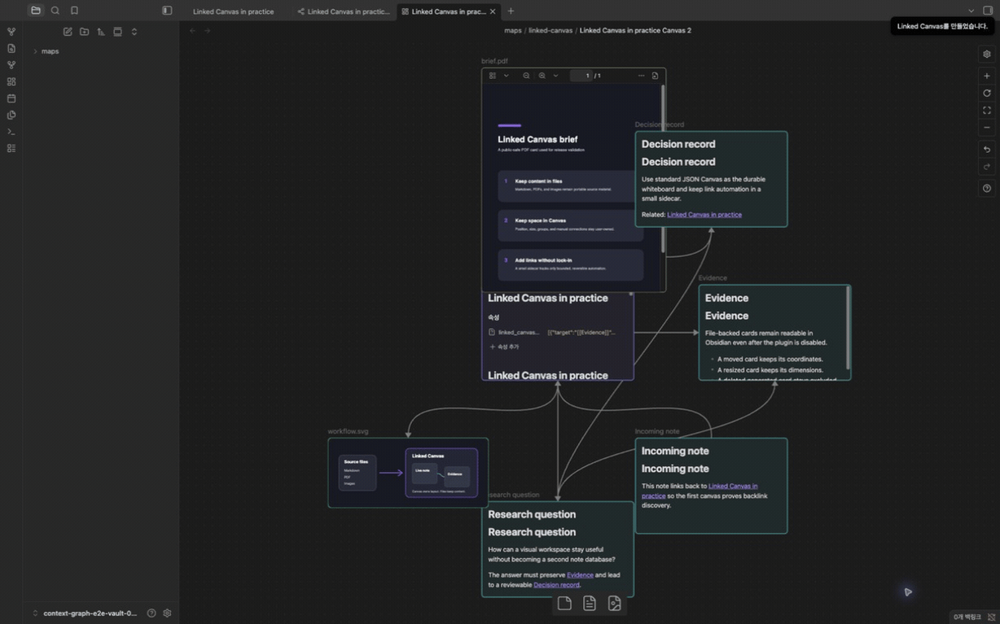
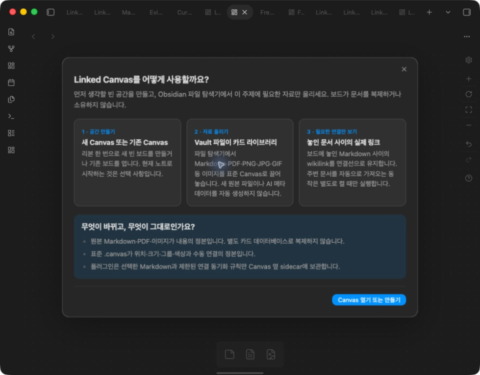
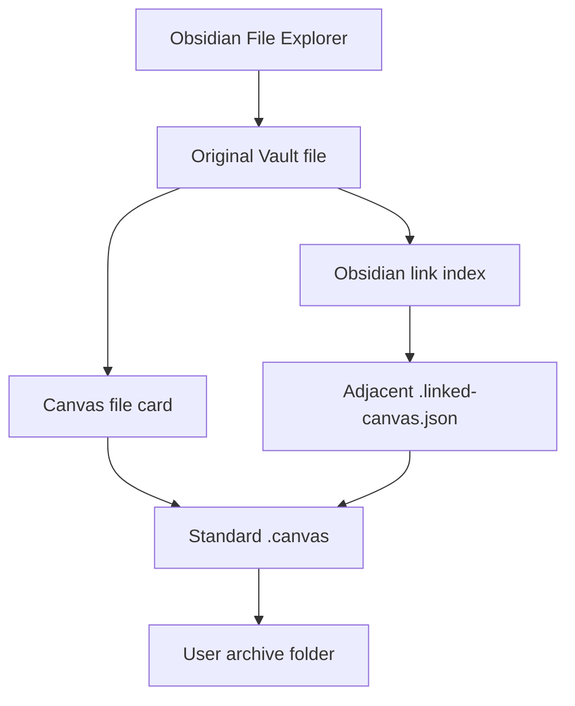
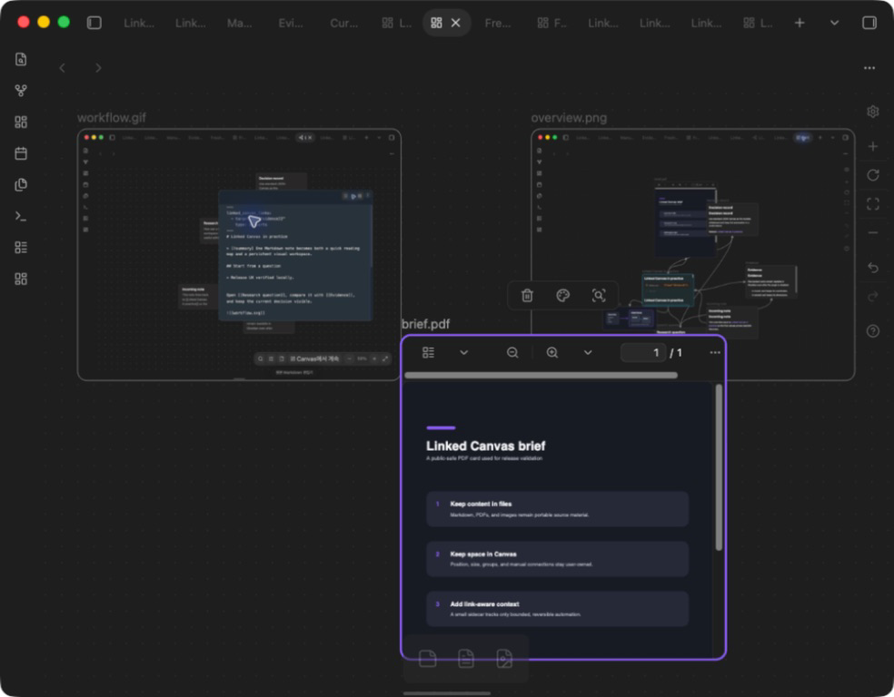
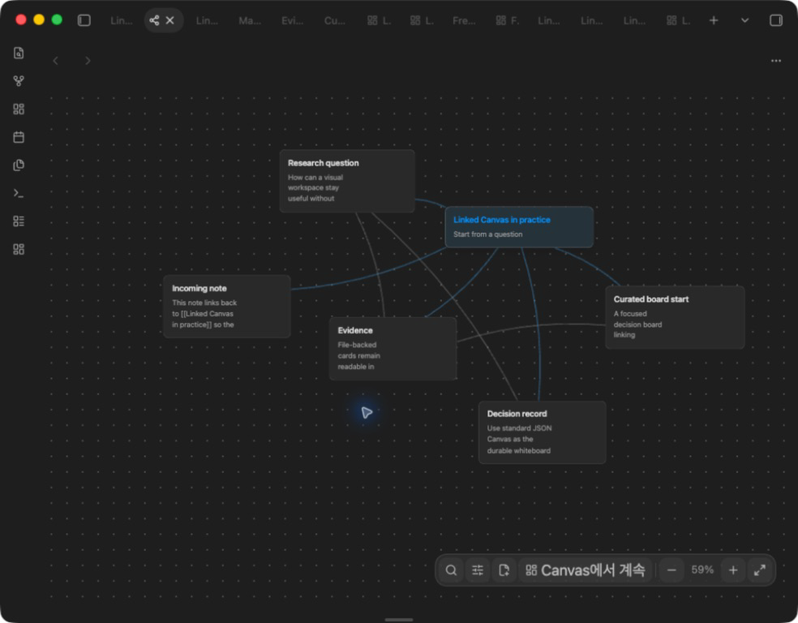
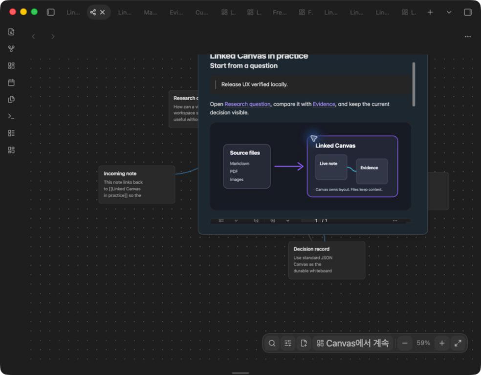
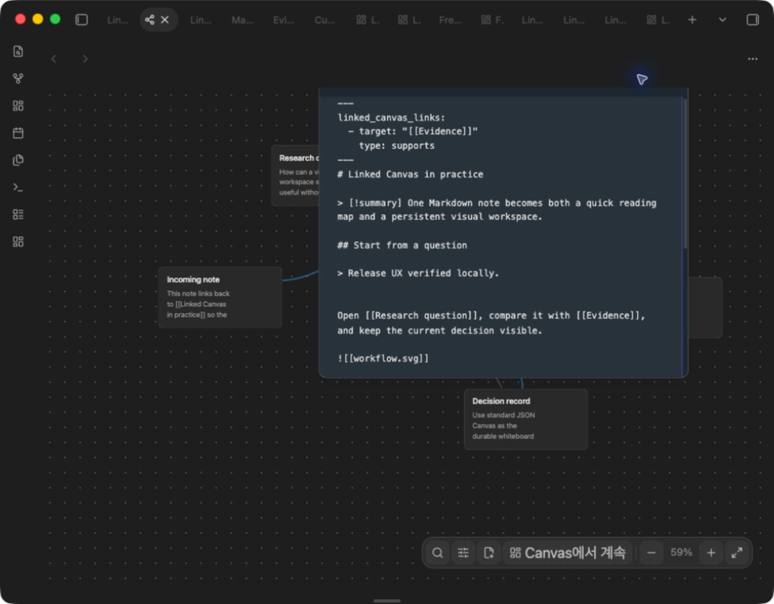

# Linked Canvas

**Arrange the Vault files you choose on a useful visual workspace—without
copying their content into another database.**

Select one ribbon icon, then create a blank standard Obsidian Canvas, start with
the current note, or reopen an existing board. Drag only the Markdown, PDFs, and
images that belong in this thinking context from Obsidian's File Explorer.
Linked Canvas keeps real relations between the cards you chose without taking
ownership of the board.



## Choose the surface by the job

| You want to… | Start here | What you get |
| --- | --- | --- |
| arrange notes and references for later | **Linked Canvas** — the default | A reusable standard `.canvas` whose layout remains yours |
| inspect one note's immediate context, then leave | **Linked Map** — optional | A temporary one-hop reader with search, Reading, and Source mode |
| deliberately grow around the cards you chose | **Enable link-aware sync** | Existing geometry stays untouched; direct linked file cards are added |

The files stay the source of truth. The Canvas owns space. A small sidecar owns
only the bounded link automation that you explicitly enable.

The launcher does **not** turn a prompt or current note into generated
Markdown. **Start with current note** simply places a file card that points to
the already open `.md`; **New blank Canvas** starts with no cards at all.

If the flow is unclear after installation, run **Show how to use Linked Canvas**
from the Command palette or open **Settings → Linked Canvas → How it works**.
The same task-first guide explains space, material, relationships, and ownership.



## Why this plugin exists

Obsidian already has a Local Graph and Canvas. Each is good at a different job:

- Local Graph shows connections, but it is not a document-reading workspace.
- Canvas is a capable whiteboard, but starting from the note you are reading
  and keeping deliberately chosen file cards related still takes manual work.

Linked Canvas adds the missing bridge. Start with a blank board or an existing
note, place only useful source files, and keep the result as ordinary JSON
Canvas. Disable the plugin and the
Markdown, PDFs, images, groups, text cards, positions, sizes, and manual edges
remain normal Obsidian content.

It is most useful for:

- turning a research question into a board of sources, evidence, and decisions;
- reviewing notes produced by a long Q&A or coding session without opening a
  chain of tabs;
- arranging a project root and the documents it actually links to;
- building a learning map from prerequisites and follow-up notes; and
- collecting Markdown, PDF, and image references on one portable whiteboard.

## Your first useful board in three steps

1. Select the **Linked Canvas** ribbon icon.
2. Choose **New blank Canvas**, **Start with current note**, or an existing
   board from the same launcher—no setup wizard or required frontmatter.
3. Drag Markdown, PDFs, and images from Obsidian's File Explorer, then use
   native Canvas to move, resize, group, connect, and edit them.

Nothing is placed automatically on a blank board. **Start with current note** is
only a shortcut that references that existing Markdown as the first file card;
it does not create or copy Markdown. Relations among chosen Markdown cards stay
synchronized without pulling in the rest of an index or daily-note hub.
When you only need to inspect context, run **Advanced: explore around the
current note in Linked Map**. Read or edit there, then choose **Continue in Canvas** when it
deserves a durable spatial arrangement. A Canvas where the note was deliberately
placed as a root or seed is reused; merely appearing as an automatically derived
neighbour does not prevent the note from starting its own board.

To deliberately add every direct neighbour of the Markdown cards already on a
board, run **Linked Canvas: Enable link-aware sync for the current Canvas**.
This opt-in is useful for a small research cluster, but the default stays
curated so a dashboard or daily-note index cannot flood the board. A note may
appear on multiple canvases; its Markdown remains one source file while each
canvas keeps its own layout.

## How files, boards, and automation fit together

The Vault replaces a proprietary Card Library: each Markdown note, PDF, image,
audio file, or other attachment remains an ordinary file. A standard `.canvas`
references those files and stores only the spatial composition. A board made
from the Linked Canvas launcher receives an adjacent, initially empty sidecar
so the plugin can distinguish user-owned cards and edges from its own link
assistance. An existing native Canvas receives no sidecar until you explicitly
enable link-aware sync. The sidecar is not a note or a second card database.

How does one Vault file become a reusable card without being copied?



1. `Original Vault file` owns content; editing a Markdown file card edits that
   same `.md`.
2. `Standard .canvas` owns coordinates, sizes, groups, colours, text cards, and
   manual edges; the same source can appear on many boards.
3. `Adjacent .linked-canvas.json` contains paths and generated-object IDs, never
   note bodies, PDF bytes, image bytes, or AI-generated metadata.
4. Moving or renaming a Canvas in File Explorer is the archive operation; while
   the plugin is enabled, its sidecar follows the Canvas while source files
   stay where they are.

For example, a board named `Research.canvas` has this portable shape:

```text
Projects/Research.canvas
Projects/Research.linked-canvas.json   # paths, exclusions and managed IDs only
Sources/Question.md                    # content remains here
Sources/Paper.pdf
Sources/Diagram.png
Sources/Demo.gif
```

Deleting or disabling Linked Canvas does not make `Research.canvas`
unreadable. Obsidian can still open its file cards and layout; only the optional
automatic edge/card reconciliation stops.

### Files you can place

Linked Canvas preserves the file cards supported by native Obsidian Canvas.
The plugin does not transcode or embed a private copy.

| Material | Canvas behaviour | Link-aware behaviour |
| --- | --- | --- |
| Markdown `.md` | Render, move, resize, and edit the original note | Can be a seed; real wikilinks and backlinks can become edges or opt-in one-hop cards |
| PDF `.pdf` | Display the original PDF as a file card | Can be brought in by a resolved Markdown link; does not expand neighbours |
| Images `.png`, `.jpg`, `.jpeg`, `.gif`, `.webp`, `.svg`, `.avif` | Display the original image; animated GIF remains a media card | Can be brought in by a resolved Markdown link; does not expand neighbours |
| Audio and other Vault files | Preserve the native Canvas file card behaviour available in the installed Obsidian version | Remain material, not semantic seeds |
| Web URL | Preserve a native Canvas link card | Never copied into the Vault or sent to a plugin service |

### Native Canvas gestures

The primary workspace uses Obsidian's gestures instead of the custom Linked Map
gesture model:

- drag a selected card to move it and use its handles to resize it;
- drag empty space while holding `Space`, or drag with the middle mouse button,
  to pan;
- scroll to pan vertically and use `Shift` + scroll to pan horizontally;
- use `Space` or `Cmd`/`Ctrl` with the mouse wheel to zoom; and
- select a card before scrolling its document contents.

Linked Canvas does not intercept those native Canvas pointer events. The
optional Linked Map remains an advanced reading command and is not shown in the
Markdown file menu or first-use launcher.

## Two surfaces, one set of files

| Surface | Use it for | Persistence | Content authority |
| --- | --- | --- | --- |
| **Linked Canvas — primary** | Arrange a durable whiteboard with notes, PDFs, images, groups, text, and connections | Standard `.canvas` plus a small `.linked-canvas.json` automation profile | Original files for content; Canvas for layout |
| **Linked Map — secondary** | Quickly inspect, read, search, and expand one linked-note branch before deciding what belongs on a board | Temporary unless opening a legacy saved-map definition | Original Markdown |

This separation is deliberate. Reading should be immediate; spatial curation
should be durable. The plugin does not force every quick inspection to become a
board, and it does not hide a proprietary card database behind the Canvas.

## See the real desktop workflow

These captures were made in Obsidian 1.13.7 with the exact 0.5.12 build and a
public-safe fixture. Their version, dimensions, and hashes are checked during
every release build.

### 1. Build a curated native Canvas from Vault files



An optional starting note is a generous anchor. Files placed by the user keep
their native Canvas or user-selected colours. Only cards first added by an
explicit link-aware expansion receive restrained standard JSON Canvas role
colours for Markdown, PDF, and image material. Automatic one-hop expansion is
opt-in rather than first-placement behaviour. After placement, the user owns
every card's position, size, group, and colour.

### 2. Inspect links before you commit to a board



Linked Map starts from the active note and includes resolved outgoing links and
backlinks. The dot grid, surface contrast, and focused root make the reading
range visible without turning the whole Vault into an analytics view.

### 3. Read complete Markdown without losing the map



The open card uses Obsidian's native Markdown renderer. Headings, lists,
callouts, links, embeds, images, PDFs, code, tables, math, supported HTML,
themes, and registered Markdown post-processors keep their normal behaviour.
Long content scrolls inside the card; the map and neighbouring notes do not
reflow.

### 4. Edit the same source file in place



Source mode shows the complete file, including frontmatter. Returning to
Reading updates the same card element at the same graph coordinate. For editor
commands or properties UI, **Open source in the right editor** reuses one normal
Obsidian pane without changing map scope or layout.

## What Linked Canvas keeps in sync

When a Linked Canvas is active:

- manually dropped Markdown cards become deliberate seeds without importing
  their neighbours by default;
- resolved links between Markdown cards already on the board become directed
  visual edges;
- one-hop outgoing links and backlinks become additional file cards only after
  **Enable link-aware sync** is explicitly run;
- linked PDFs and images can become independent Canvas cards;
- moving, resizing, recolouring, or grouping a card remains user-owned;
- text cards, link cards, groups, backgrounds, and manual visual edges are
  preserved byte-for-byte in meaning;
- deleting an automatically discovered card records an exclusion, so the next
  sync does not recreate it; and
- dropping that Markdown file again removes the exclusion and makes it an
  explicit seed.

Renaming a source note updates the active profiles and Canvas file-card paths.
Renaming a Canvas moves its sidecar and updates the sidecar's `canvasPath`.
Malformed Canvas or profile JSON fails closed: the plugin does not widen scope
or overwrite an unreadable file.

### Existing Canvas adoption

**Enable link-aware sync for the current Canvas** requires at least one
Markdown file card. Every Markdown card already on the Canvas becomes an
explicit root. Existing coordinates, sizes, colours, groups, text cards, media,
and manual connections remain in place; only missing linked cards and managed
edges are added.

### Optional Canvas-to-Markdown relationship writing

Canvas connections are visual-only by default. Run **Toggle note-link sync for
current Canvas connections** to opt in for that Canvas. After opt-in, a new
directed manual edge between two Markdown cards adds one relationship to the
source note's `linked_canvas_links` frontmatter. The write is additive and
idempotent; it does not delete ordinary links or rewrite the target note.

```yaml
linked_canvas_links:
  - target: "[[Evidence]]"
    type: supports
```

Supported authored relation types are `related`, `prerequisite`, `supports`,
`contrasts`, and `follow-up`. Unknown types are preserved in Markdown and are
not silently relabelled. A Canvas edge with another label remains visual-only;
an unlabeled edge maps to `related`. Earlier `context_tree_links` values remain
readable for compatibility; new relationship writes use `linked_canvas_links`.

## Linked Map interaction contract

| Gesture or action | Result |
| --- | --- |
| Select a compact card | Open or close native Reading at the same graph coordinate. |
| Drag a title, summary, or non-interactive frame at least 5 px | Move only that card, whether compact, open, editing, or kept open. |
| Select or scroll Reading content | Preserve native text, link, embed, and scroll behaviour. |
| Wheel over an open card, including its header | Scroll the card under the pointer. |
| Wheel over graph background | Smoothly zoom around the pane centre; stale editor focus never steals the wheel. |
| Drag empty graph background | Pan the map. |
| Keep card open | Keep that card visible while one additional document is explored; it never locks position. |
| Show/Collapse neighbouring notes | Preview and change only that card's meaningful one-hop branch. Existing cards do not re-layout. |
| Open source in the right editor | Open the same Markdown file in one reusable right-hand Obsidian pane. |
| Continue in Canvas | Reopen the root note's existing Linked Canvas, creating one only when none exists. |
| Fit graph | Close open cards and fit the current range into the pane. |

Quick actions appear on hover and keyboard focus. At overview zoom they receive
a bounded inverse scale so hit targets stay usable without covering titles. The
single graph toolbar remains fixed at the lower right. **Continue in Canvas**
is labelled on a wide pane and reduces to the same icon plus tooltip in a narrow
split. There is no duplicate `+` button on every card.

## File and ownership contract

Linked Canvas deliberately uses three small authorities:

| Data | Owner | Portable | What the plugin may do |
| --- | --- | --- | --- |
| Markdown, PDF, image, and other source content | Original Vault files | Yes | Read; edit Markdown only through an explicit editor action or opt-in additive relation write |
| Positions, sizes, colours, groups, text/link cards, and visual connections | Standard `.canvas` | Yes | Preserve existing objects; add or remove only tracked projections |
| Roots, seeds, depth, exclusions, sync policy, and generated-object provenance | Adjacent `.linked-canvas.json` | Yes | Validate, update, and follow source/Canvas renames |
| Map camera, kept-open state, deliberate legacy-map positions, and recoverable drafts | Plugin `data.json` | Device-local | Persist only UI state and conflict recovery |

The sidecar never contains copied note bodies. If profile creation fails after a
Canvas is created, the standard Canvas is kept instead of being deleted.

## Safe editing and failure behaviour

In-card Source autosaves through Obsidian's Vault API with an optimistic
revision check. If another editor changes the file after Source mode opens,
Linked Canvas stops before overwriting it, keeps the draft in local plugin data,
and offers explicit recovery actions. A content-only refresh updates the same
card; it does not recreate the node or run a new layout.

Graph-only removal and source deletion are separate actions. **Remove from
graph** changes only the current scope. **Move source note to trash** uses
Obsidian's configured trash and requires distinct destructive wording and
confirmation.

## How it differs from other visual tools

These tools can coexist. Linked Canvas is intentionally narrow: it starts from
inspectable Markdown links, lets you read before arranging, and saves the useful
result as native Canvas.

| Tool | Primary strength | Linked Canvas is different because… |
| --- | --- | --- |
| **Obsidian Local Graph** | Fast neighbourhood topology | Its cards become readable/editable documents and can graduate into a durable Canvas. |
| **Obsidian Canvas** | General-purpose spatial authoring | A board can start empty or with one existing note, reuses original files across boards, and can opt into bounded link expansion without losing native Canvas ownership. |
| [Heptabase](https://heptabase.com/) | A complete card-and-whiteboard knowledge environment | Linked Canvas stays inside Obsidian, keeps existing files authoritative, and does not introduce another account or card database. |
| [Excalidraw](https://github.com/zsviczian/obsidian-excalidraw-plugin) | Drawing, sketching, and media-rich visual thinking | Linked Canvas focuses on file-backed document neighbourhoods rather than a drawing model. |
| [Juggl](https://github.com/HEmile/juggl) | Stylable graph workspaces and layouts | Linked Canvas offers a deliberately bounded reader-to-native-Canvas path. |
| [ExcaliBrain](https://github.com/zsviczian/excalibrain) | Structured inferential mind maps | Linked Canvas uses resolved authored links and optional explicit relation types; no semantic inference is required. |
| [Breadcrumbs](https://github.com/SkepticMystic/breadcrumbs) | Typed hierarchies and trail views | Ordinary wikilinks are sufficient, and the linked source can be read in place. |

Linked Canvas is not a Heptabase clone and does not copy its trade dress. It
adopts the useful product principle—spatial context should help people
understand real notes—while using Obsidian's files, renderer, Canvas format,
and interaction conventions.

The design intentionally combines two independent references: Cupertino's
native, quiet visual hierarchy and Heptabase's card/whiteboard ownership model.
Linked Canvas adapts Cupertino's MIT-licensed colour, elevation, motion, and
rounded-control values into one plugin-scoped token layer. It neither imports
global theme selectors nor requires Cupertino to be installed, so other themes
retain their global UI while the plugin keeps a coherent visual hierarchy. The
original Vault file remains the reusable card and standard Canvas remains the
spatial context. See [the design system](docs/design-system.md) and
[third-party notices](THIRD_PARTY_NOTICES.md) for the exact boundary.

## Privacy and permissions

Linked Canvas has no account, telemetry, analytics, advertisements, external
API, semantic AI, remote-code loader, or network client. It reads files through
Obsidian's Vault APIs and does not access files outside the Vault.

The ordinary current-note Map resolves its visible neighbourhood from
Obsidian's cached link index. Legacy broad graph scopes and optional authored-ID
uniqueness checks may enumerate Markdown paths, but content is read only for
notes included in the active view. Saved-map discovery is limited to the
plugin-owned map folder. Nothing is transmitted.

See [SECURITY.md](SECURITY.md) for the security boundary and reporting process.
The single interaction and persistence contract is
[docs/ux-contract.md](docs/ux-contract.md). The visual architecture and
theme-compatibility rules are documented in
[docs/design-system.md](docs/design-system.md).

## Commands

| Command | When to use it |
| --- | --- |
| **Open current note in Linked Canvas** | Reuse a Canvas containing the active note, or create its first board. |
| **Show how to use Linked Canvas** | Reopen the task-first Canvas/Map guide and ownership explanation. |
| **Advanced: explore around the current note in Linked Map** | Temporarily inspect the active Markdown note and its direct neighbourhood without making it the default workflow. |
| **Create a Linked Canvas from the current note** | Deliberately create an additional native Canvas for the same note. |
| **Enable link-aware sync for the current Canvas** | Adopt an existing Canvas that already contains Markdown cards. |
| **Sync the current Linked Canvas** | Request an immediate reconciliation; automatic sync also follows relevant Vault changes. |
| **Toggle note-link sync for current Canvas connections** | Explicitly opt in or out of additive Canvas-to-Markdown relationship writes. |
| **Open saved graphs** | Open legacy `.context-graph` workspaces retained for compatibility. |
| **Refresh graph** | Refresh an open Linked Map or legacy saved map. |

The Markdown file menu provides only **Open current note in Linked Canvas** for
the selected file. Linked Map remains available as an advanced Command palette
action so it does not compete with the whiteboard workflow.

## Current scope and non-goals

- Desktop Obsidian is supported. Mobile and touch remain disabled until they
  receive their own interaction and accessibility test pass.
- Linked Canvas follows explicit resolved links. It does not infer semantic
  similarity, generate relationships, or unfold an unbounded Vault.
- The plugin enhances standard Canvas; it does not replace Canvas drawing,
  shapes, presentations, or every full-editor command.
- Canvas-to-Markdown relationship writing is opt-in, additive, and directional.
  Visual connections remain visual-only by default.
- In-card Source is a focused autosaving editor. Use the right-hand native pane
  when you need the complete Obsidian editing ecosystem.
- Pointer relationship authoring does not yet have a keyboard-equivalent edge
  drawing gesture. Reading, editing, search, filters, and card actions remain
  keyboard accessible.

## Compatibility with Context Graph releases

The plugin ID remains `context-graph` so existing Community installations and
local settings update in place. The visible product name is now **Linked
Canvas**. Existing `.context-graph` definitions, `context_tree_links`, and
legacy metadata remain readable; the plugin does not rewrite old notes in the
background. New durable whiteboards use standard `.canvas` files and adjacent
`.linked-canvas.json` profiles. A blank board is created beside the active file,
or at the Vault root when no file is active; starting with a note creates the
board beside that note. Linked Canvas never requires a plugin-owned content
folder.

Users of the pre-0.4.0 local build should move `data.json`, `main.js`,
`manifest.json`, and `styles.css` from `.obsidian/plugins/context-tree/` to
`.obsidian/plugins/context-graph/`, then replace `context-tree` with
`context-graph` in `.obsidian/community-plugins.json` before reloading.

## Installation

From Obsidian Community plugins:

1. Open **Settings → Community plugins → Browse**.
2. Search for **Linked Canvas**.
3. Select **Install**, then **Enable**.
4. Select the Linked Canvas ribbon icon from any workspace. Start blank, start
   with the active Markdown note when one exists, or open any existing Canvas.

For a manual release install, download `main.js`, `manifest.json`, and
`styles.css` from the same GitHub release and place them in:

```text
<vault>/.obsidian/plugins/context-graph/
```

Reload Obsidian and enable **Linked Canvas** under **Settings → Community
plugins**.

## Development and verification

Node.js 20 or newer is required.

```bash
npm ci
npm run check
npm audit --omit=dev --audit-level=high
```

`npm run check` runs ESLint, strict TypeScript checking, CSS validation, release
media verification, a production esbuild bundle, and the unit suite. The 0.5.11
release additionally follows the desktop checklist in
[docs/ux-contract.md](docs/ux-contract.md): real Map and Canvas creation,
Markdown rendering/editing, pointer-owned scroll and zoom, card movement,
geometry preservation, manual seed expansion, deletion exclusion and restore,
existing Canvas adoption, opt-in relation writing, source/Canvas rename, and
plugin-disable portability. A build alone is not treated as runtime proof.

Repository boundaries:

```text
src/domain/                  pure interaction, graph, JSON Canvas, and profile rules
src/graph/                   force simulation and map geometry
src/ui/                      card rendering, native Markdown frame, and copy
src/linked-canvas-service.ts Vault/Canvas reconciliation and rename coordination
src/parser.ts                Vault Markdown to Linked Map nodes
src/topic-store.ts           explicit Markdown and relationship writes
src/graph-definition-store.ts legacy saved-map Vault I/O
src/main.ts                  plugin lifecycle, commands, and event routing
src/view.ts                  Linked Map view and direct manipulation
tests/                       focused unit/regression tests and public-safe fixtures
```

Contributors should read [CONTRIBUTING.md](CONTRIBUTING.md). Maintainers use the
[release and Community directory process](docs/release-process.md).

## License

[MIT](LICENSE)
