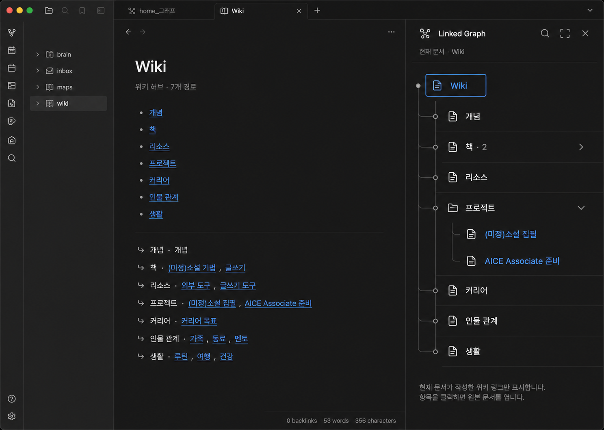

# Linked Graph design QA

## Reference

## Rendered implementation

## Review

| Criterion | Result | Evidence |
|---|---|---|
| Canonical note remains dominant | passed | Wiki Markdown stays in the main editor; the tool occupies the right sidebar only. |
| Current-note context is explicit | passed | Header shows `현재 문서 · Wiki`; root shows `Wiki · 7`. |
| Authored order remains readable | passed | 개념, 책, 리소스, 프로젝트, 커리어, 인물 관계, 생활 match the source order. |
| Progressive disclosure is bounded | passed | Expanding 프로젝트 reveals only 창작, 취업, 학습, 개발 with counts; their documents remain collapsed. |
| Controls are compact and native | passed | Search and collapse-all use Obsidian/Lucide icon buttons. |
| Narrow-sidebar behaviour | passed | Labels truncate rather than overlap; reduced indentation preserves route names at the current host width. |
| No second knowledge surface | passed | The runtime exposes navigation and preview only; no create, edit, connect, Canvas, Map, or save action appears. |
| Theme and contrast | passed | Runtime colours derive from the active Obsidian dark theme, with blue links and visible disclosure icons. |

The host sidebar width is user-controlled and is narrower than the selected target. The implementation adapts without forcing a global Obsidian layout width.

final result: passed
